# 問題

以下の各関数 `f3` から `f12` までを実行すると何が出力されるか予想し実際に確認しなさい。
またその理由を 2、3 行のテキスト、図のいずれかまたは両方で説明しなさい。

```js
function f1() {
  // NOTE: f2 との比較用 (注: () => wait(...) は () => { return wait(...); } と同じことに注意
  //
  // 回答:
  // 3秒後に A が出力され、その2秒後に B が出力され、その1秒後に C が出力される。
  //
  // 説明:
  // wait3 の解決後に logA が実行され、wait2().then(logB) の解決後 (2秒後に B 出力) に wait1().then(logC) が実行されるため。
  //
  // 図解:
  //  wait3
  // |---------------|
  //                  logA
  //                 |-|
  //                    wait2
  //                   |----------|
  //                               logB
  //                              |-|
  //                                 wait1
  //                                |-----|
  //                                       logC
  //                                      |-|
  wait3()
    .then(logA)
    .then(() => wait2().then(logB)) // アロー関数は波括弧を使わない省略記法の場合は自動的にreturnする
    .then(() => wait1().then(logC));
}
```

```
function f2() {
  // NOTE: 2つ目の then の中で return が無くなっていることに注意 (典型的なミス)
  //
  // 解答例:
  // 3秒後に A が出力され、その1秒後に C が出力され、その1秒後に B が出力される。
  // 2つ目の .then のコールバック関数が値を return していないため、この .then が返す Promise は即解決される。
  // このため logA() の実行すぐ後に wait1().then(...) が実行され C が先に出力される。
  //
  // 図解:
  //  wait3
  // |---------------|
  //                  logA
  //                 |-|
  //                    wait2
  //                   |----------|
  //                               logB
  //                              |-|
  //                  wait1
  //                 |-----|
  //                        logC
  //                       |-|
  wait3()
    .then(logA)
    .then(() => {
      wait2().then(logB);  // アロー関数は波括弧を使った場合は明示的にreturnしないと返さない
    })
    .then(() => wait1().then(logC));
}
```

# 回答

## f3

```
function f3() {
  // NOTE: then のコールバック内の例外は try/catch でキャッチできるだろうか
  try {
    wait(0).then(logA).then(errX);
  } catch (e) {
    logB();
  } finally {
    logC();
  }
}
```

### 予想:

すぐにCが出て、その後すぐAが出て、その後エラーXが出て、logBが出る。　×間違い：logBはでなかった。。

### 結果：

C
(0.01s 経過)
A
(0.01s 経過)
file:///C:/JS_training/js-exercises/ch13/waitUtils.js:33
throw new Error("X");
^

Error: X
at errX (file:///C:/JS_training/js-exercises/ch13/waitUtils.js:33:9)

### 理由:

try/catch/finallyは同期部分にしか効かない。
finallyは同期コードなのでlogCはすぐ実行される。
wait(0)後、logA実行、errX()がthrowされるが、Promiseのthenのコールバック内部の例外なので、外側の try/catch では処理されない。

```mermaid
gantt
  title f3
  dateFormat  s
  axisFormat |
    finally(logC)   :fc, 0, 0.2s
    wait0           :w0, 0, 0.1s
    logA            :la, after w0, 0.2s
    throw X         :tx, after la, 0.1s
```



---

## f4

```
function f4() {
  // NOTE: f5 との比較用
  wait2()
    .then(() => {
      logA();
      return 40;
    })
    .then((value) =>
      wait(1000).then(() => {
        logB();
        return 100;
      })
    )
    .then((v) => log(v));
}
```

### 予想:

2秒後にA、その1秒後にB、直後に100

### 結果

f4 with time:
A
(2.02s 経過)
B
(3.03s 経過)
100

### 理由:

2つ目のthenはwait(1000).then(...)で戻り値100を返すため、最終 thenはその100を受け取って出力。

```mermaid
gantt
  title f4
  dateFormat  s
  axisFormat |
    wait2           :w2, 0, 2s
    logA            :lA, after w2, 0.2s
    wait1           :w1, after lA, 1s
    logB            :lB, after w1, 0.2s
    log(100)        :v100, after lB, 0.2s

```



---

## f5

```
function f5() {
  // NOTE: 2つ目の then の引数が関数でなく Promise になっている (典型的なミス)
  wait2()
    .then(() => {
      logA();
      return 40;
    })
    .then(
      wait1().then(() => {
        logB();
        return 100;
      })
    )
    .then((v) => log(v));
}
```

### 予想

2秒後にAが出て、その1秒後にBが出てすぐあとに100が出る。　×間違い

### 出力

B
(1.02s 経過)
A
(2.01s 経過)
40
(2.01s 経過)

### 理由:

2つ目の then の引数が関数でなく Promise になっているため、コールバックではなく実行するため、さきに1秒後に実行してBが出る。
Aは2秒後に出力され、戻り値40がすぐに最後のthenで出力される。

```mermaid
gantt
  title f5
  dateFormat  s
  axisFormat |
    wait1    :w1s, 0, 1s
    logB      :lBs, after w1s, 0.2s
    wait2    :w2m, 0, 2s
    logA      :lAm, after w2m, 0.2s
    log(40)   :v40, after lAm, 0.2s

```



## f6

```
function f6() {
  // NOTE: 1つの Promise に対し then を2回呼び出すとどうなるか

  const p = wait1().then(logA);
  p.then(() => wait1()).then(logB);
  p.then(() => wait2()).then(logC);
}
```

### 予想

1秒後にAが出て、その1秒後にBが出て、その2秒後にCが出る。　×間違い

### 出力

f6 with time:
A
(1.01s 経過)
B
(2.02s 経過)
C
(3.01s 経過)

### 理由:

同一のpに対してthenを複数回呼ぶとそれぞれ独立に実行される。
A出力後に、別々の待ち時間を経て順にB,Cと出力。

```mermaid
gantt
  title f6
  dateFormat  s
  axisFormat |
    wait1 (p)       :w1, 0, 1s
    logA            :lA, after w1, 0.2s
    wait1 -> B      :w1b, after lA, 1s
    logB            :lB, after w1b, 0.2s
    wait2 -> C      :w2c, after lA, 2s
    logC            :lC, after w2c, 0.2s

```



## f7

```
function f7() {
  // NOTE: 2つ目の wait の引数が実行される差には p は解決済み
  // (= 解決済みの Promise の then を呼び出すとどうなるか)
  const p = wait1().then(logA);
  wait2()
    .then(() => {
      return p.then(logB);
    })
    .then(logC);
}
```

### 予想

2秒後にB、その1秒後にA、その後すぐにC　　×間違い。。

### 出力:

f7 with time:
A
(1.01s 経過)
B
(2.02s 経過)
C
(2.02s 経過)

### 理由:

Aは先に1秒後にすぐに出力。
並行して、2秒後にwait2が解決してから すでに解決済みのpに対するthen(logB)を呼ぶためlogBが出力、その解決を受けてlogCも直後に続く。

```mermaid
gantt
  title f7
  dateFormat  s
  axisFormat |
    wait1 (p)               :w1, 0, 1s
    logA                    :lA, after w1, 0.2s
    wait2   :w2, 0, 2s
    p.then(logB) :lB, after w2, 0.2s
    then(logC)              :lC, after lB, 0.2s

```



## f8

```
function f8() {
  // NOTE: f9, f10 との比較用
  wait1()
    .then(errX)
    .then(errY)
    .catch((e) => log(e.message))
    .finally(logA);
}
```

### 予想

1秒後にAが出漁されて、エラーXとエラーYが出る。　×間違い。。

### 出力:

f8 with time:
X
(1.01s 経過)
A
(1.02s 経過)

### 理由:

errXが投げた例外で拒否になり、次のthen(errY)はスキップ。
catchがXを出力し、最後にfinallyのlogAが実行される。

```mermaid
gantt
  title f8
  dateFormat  s
  axisFormat |
    wait1           :w1, 0, 1s
    throw X (then)  :tx, after w1, 0.1s
    catch -> "X"    :cX, after tx, 0.2s
    finally -> A    :fA, after cX, 0.2s

```



## f9

```
function f9() {
  // NOTE: f10 との比較用
  wait1()
    .then(() => 42)
    .then(errY)
    .catch((e) => log(e.message))
    .finally(logA);
}
```

### 予想

1秒後のエラーY、最後にA出力。

### 出力:

f9 with time:
Y
(1.02s 経過)
A
(1.02s 経過)

### 理由:

値42が変えるが、その後の.then(errY)でエラーthrow。
catchがYを出力し、finallyでA出力。

```mermaid
gantt
  title f9
  dateFormat  s
  axisFormat |
    wait1              :w1, 0, 1s
    pass 42            :p42, after w1, 0.1s
    throw Y (then)     :tY, after p42, 0.1s
    catch -> "Y"       :cY, after tY, 0.2s
    finally -> A       :fA, after cY, 0.2s

```



## f10

```
function f10() {
  // NOTE: then(r, c) と then(r).catch(c) は等しいか？
  wait1()
    .then(() => 42)
    .then(errY, (e) => log(e.message))
    .finally(logA);
}
```

### 予想

1秒後にAが出力され、エラーYが出る

### 出力:

f10 with time:
A
(1.02s 経過)
file:///C:/JS_training/js-exercises/ch13/waitUtils.js:36
throw new Error("Y");
^

Error: Y
at errY (file:///C:/JS_training/js-exercises/ch13/waitUtils.js:36:9)
at errYwithTime (file:///C:/JS_training/js-exercises/ch13/ex02/f10.js:36:3)

### 理由:

同期処理で.finally(logA)が走り、A出力。
値42が渡され、errYが呼ばれてthrow。
しかし onRejectedが呼ばれないためcatchされない。

```mermaid
gantt
  title f10
  dateFormat  s
  axisFormat |
    wait1                 :w1, 0, 1s
    pass 42               :p42, after w1, 0.1s
    then(errY):ty, after p42, 0.1s
    finally -> A          :fA, after ty, 0.2s
                         :uh, after fA, 0.1s

```

## f11

```
function f11() {
  // f12 との比較用: new Promise 内の throw は .catch でキャッチできるか？
  new Promise((resolve, reject) => {
    errX();
  }).catch((e) => log(e.message));
}
```

### 予想

すぐにエラーXが出て、エラーメッセージが出力される。

### 出力: `X`

f11 with time:
X
(0.01s 経過)

### 理由:

new Promise内でthrowすると、その場でrejectと同等。
したがって.catchでキャッチして、Xを出力。

```mermaid
gantt
  title f11
  dateFormat  s
  axisFormat |
    throw X                  :tx, 0, 0.1s
    catch -> "X"            :cX, after tx, 0.2s

```



## f12

```
function f12() {
  // new Promise 内だがコールバック関数で throw した場合は？
  new Promise((resolve, reject) => {
    setTimeout(() => errX(), 0);
  }).catch((e) => log(e.message));
}
```

### 予想

何も出力されない

### 出力:

f12 with time:
file:///C:/JS_training/js-exercises/ch13/waitUtils.js:33
throw new Error("X");
^

Error: X
at errX (file:///C:/JS_training/js-exercises/ch13/waitUtils.js:33:9)
at errXwithTime (file:///C:/JS_training/js-exercises/ch13/ex02/f12.js:31:3)
at Timeout.\_onTimeout (file:///C:/JS_training/js-exercises/ch13/ex02/f12.js:41:22)
at listOnTimeout (node:internal/timers:573:17)
at process.processTimers (node:internal/timers:514:7)

### 理由:

setTimeoutコールバック内のthrowはPromiseの外で起きるため、.catch(...)は発火しない。
例外はタスクの未捕捉例外としてコンソールに出る。

```mermaid
gantt
  title f12
  dateFormat  s
  axisFormat |
    setTimeout 0ms         :t0, 0, 0.1s
    callback -> throw X    :tx, after t0, 0.1s
    catch (never runs)     :nr, after tx, 0.1s

```



## 参考

- マクロタスク（Task）
  タスクキューに入れられ、1つずつ処理される。
  代表例: `setTimeout`, `setInterval`, `setImmediate`(Node), I/O
- マイクロタスク（Microtask）
  現在のマクロタスク終了後すぐに、次のマクロタスクに移る前に必ず全部処理される。
  代表例: `Promise.then`, `catch`, `finally`, `queueMicrotask`
