# 問題

h1～h4の各関数を実行すると何が出力されるか予想し実際に確認しなさい。  
またその理由を 2、3 行のテキスト、図のいずれかまたは両方で説明しなさい。

# 回答

## h1

```js
async function h1() {
  try {
    await wait3();
    logA();
    await wait2();
    logB();
    await wait1();
    logC();
  } catch (e) {
    log(e.message);
  }
}
```

### 出力

h1 with time:
A
(3.01s 経過)
B
(5.02s 経過)
C
(6.03s 経過)

### 理由

async/awaitで順番に待ってからログしているため直列に進む。  
try/catchは全体を覆っているが、ここでは例外が出ないのでA→B→Cがそのまま出力される。

```mermaid
gantt
  title h1
  dateFormat  s
  axisFormat |
    wait3 :w3, 0, 3s
    A     :a,  after w3, 0.2s
    wait2 :w2, after a, 2s
    B     :b,  after w2, 0.2s
    wait1 :w1, after b, 1s
    C     :c,  after w1, 0.2s

```



## h2

```js
function h2() {
  // NOTE: h3 との比較用
  new Promise(() => {
    errX();
  }).catch((e) => log(e.message));
}
```

### 出力

h2 with time:
X
(0.01s 経過)

### 理由

new Promise内で同期的にthrowすると、その場でPromiseは拒否となり、直後の.catchがXを受け取って出力する。

```mermaid
gantt
  title h2
  dateFormat  s
  axisFormat |
    throw X :t, 0, 0.1s
    catch -> "X"           :c, after t, 0.2s

```



## h3

```js
function h3() {
  // NOTE: new Promise の引数が async function の場合、例外はどう扱われるだろう
  new Promise(async () => {
    errX();
  }).catch((e) => log(e.message));
}
```

### 出力

h3 with time:
file:///C:/JS_training/js-exercises/ch13/waitUtils.js:33
throw new Error("X");
^

Error: X
at errX (file:///C:/JS_training/js-exercises/ch13/waitUtils.js:33:9)
at errXwithTime (file:///C:/JS_training/js-exercises/ch13/ex07/index.js:21:3)
at file:///C:/JS_training/js-exercises/ch13/ex07/index.js:63:5
at new Promise (<anonymous>)
at h3_withTime (file:///C:/JS_training/js-exercises/ch13/ex07/index.js:62:3)
at file:///C:/JS_training/js-exercises/ch13/ex07/index.js:90:1
at ModuleJob.run (node:internal/modules/esm/module_job:218:25)
at async ModuleLoader.import (node:internal/modules/esm/loader:329:24)
at async loadESM (node:internal/process/esm_loader:28:7)
at async handleMainPromise (node:internal/modules/run_main:113:12)

### 理由

new Promise の引数が async function の場合、throwは同期例外ではなく「戻り値の Promise の拒否」になる。
.catchは発火しない。

## h4

```js
async function h4() {
  // NOTE: 2つの例外は両方 catch できるか？
  try {
    const p1 = wait2().then(() => {
      errX();
    });
    const p2 = wait1().then(() => {
      errY();
    });
    await p1;
    await p2;
  } catch (e) {
    log(e.message);
  }
}
```

### 出力

h4 with time:
file:///C:/JS_training/js-exercises/ch13/waitUtils.js:36
throw new Error("Y");
^

Error: Y
at errY (file:///C:/JS_training/js-exercises/ch13/waitUtils.js:36:9)
at errYwithTime (file:///C:/JS_training/js-exercises/ch13/ex07/index.js:25:3)
at file:///C:/JS_training/js-exercises/ch13/ex07/index.js:77:7

### 理由

`p2`は1秒後に"Y"で拒否`p1`は 2秒後に"X"で拒否。
`await p1`が先なので 2秒時点で"X"を`catch`が受けて出力し、関数は終了する。
その結果、`p2` は誰にも `await` / `catch` されず、未処理拒否 "Y" になる。

```mermaid
gantt
  title h4
  dateFormat  s
  axisFormat |
    p2: wait1 -> throw Y :p2w, 0, 1s
    p1: wait2 -> throw X :p1w, 0, 2s
    catch -> "X"         :c,  after p1w, 0.2s
    err"Y"               :u, after c, 0.2s

```


