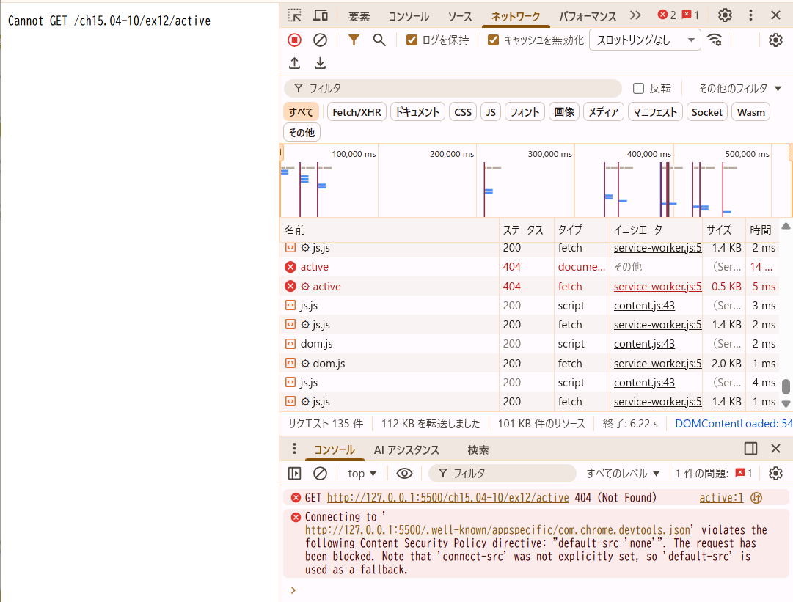

## 問題
もしpushStateを利用した実装にした場合どうなるだろうか？ 
- Active や Completed を選択後にブラウザのリロードを行うとどうなるだろうか。hashchange と pushState それぞれの実装について調べなさい
(ヒント: 開発者ツールでどのような通信が発生しているか調べてみなさい)。
- ここまでの例は serve コマンドで HTML や JS といったファイル配信するサーバーを立ち上げてきた。
サーバー側がどのような挙動をすれば pushState を使った実装が期待通り動作するか考えて答えなさい。

## 回答
- リロード時のhashchangeとpushStateそれぞれの状況調査
  - ex11(hashchange版)
    - ActiveやCompleted選択時にネットワーク通信起きてない。（開発者ツールのネットワークタブの内容に変化がない）
    - Active や Completed を選択後にブラウザのリロードを行ってもhtmlで記載のページが表示されている。
  - 今回のex12(pushState版)
    - ActiveやCompleted選択時にネットワーク通信起きてない。（開発者ツールのネットワークタブの内容に変化がない）
    - Active や Completed を選択後にブラウザのリロードを行うと404エラーとなり、htmlで記載のページが表示されない。  
    
    URLのパスが変わるので、リロード時にそのパスでサーバにリクエストが飛ぶがそのパスには何もないので、このような挙動になると考えられる。

- サーバー側がどのような挙動をすれば pushState を使った実装が期待通り動作するか
  - ActiveやCompletedを選択後のパスでもサーバー側から本体のindex.htmlも返すようにしてあげれば良い。

以上