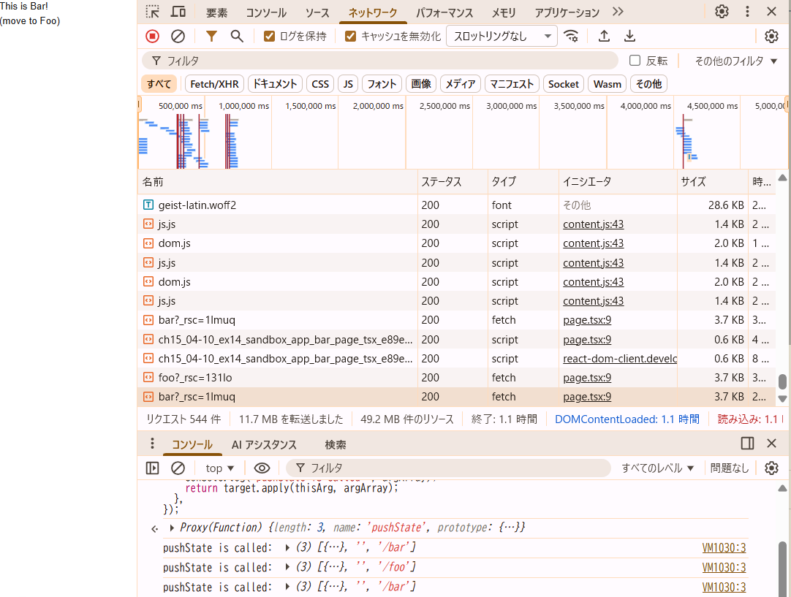
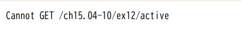

## 問題

昨今の Web アプリケーションフレームワークで `pushState` がどう使われているか調べよう。

1. 以下の動作を確認しなさい
- ブラウザの開発者ツールの「ネットワーク」タブを確認してみよう。リンクをクリックしたときに通信は発生しているだろうか？
- pushState はいつ実行されているだろうか？
- リロード時に画面の表示はどうなるだろうか？
2. 1 で確認した動作と 15.4-10.12 で確認した動作を比較し、next.js の Link でどういった処理が行われているかをまとめなさい。

## 回答
1. 動作確認
- リンククリック時、ネットワーク通信は発生しているが、最初のページアクセス時に比べて少ないように見える。
また、初回のリンククリック時はscriptとなっているが、２回目以降はfetchのみでさらに部分的に取得しているように見える。

- pushState はいつ実行されている？
FooページでLinkをクリックしてBarページに遷移したタイミングで、pushState is called: (3) [{…}, '', '/bar'] というログが出ている。
BarページでLinkをクリックしてFooページに遷移したタイミングで、pushState is called: (3) [{…}, '', '/bar'] というログが出ている。
そのため、<Link>使った遷移のときにpushStateが実行されている。

- リロード時の画面表示はどうなる？
リロードしても、ちゃんと元のページがが表示されている。

2. 1 で確認した動作とex12（自作のpushState）と比較して、next.js の Link でどういった処理が行われているか
ex12（15.4-10.12）ではリロードしたときに404エラーとなり元のページが表示されない。

Next.js の <Link> は、以下のようなことをしている。
リンククリック時、初回は document / script などを取得してきて、2 回目以降は fetch で必要な JSON や差分のみを取得。
リロード時は、どのパスでもNextアプリを返すように設定されているのでそのまま同じページが表示される

以上