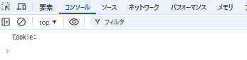
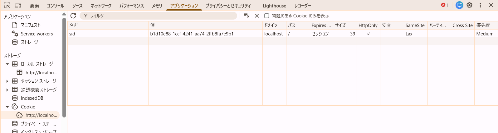

# 問題

このサーバでは Cookie を使ってクライアントのセッションを識別し、タスク一覧をセッションごとに分離して管理する簡易的な認証/認可を行っている。サーバが設定している Cookie の値は sid=<セッションに一意に割り当てた ID>; SameSite=Lax; Path=/; HttpOnly; である。ToDo アプリでいくつかのタスクを作成した後、以下に挙げる操作を実施したとき、それぞれどのような結果になるか記載し、その理由を説明しなさい。

- index.js でdocument.cookie プロパティを console.logで表示する
- ブラウザの開発者コンソールで http://localhost:3000/ の Cookie を表示する
- ToDo アプリのタブをリロードする
- 同一ブラウザの異なるタブやウィンドウで http://localhost:3000/ を開いて ToDo リストの状態を確認する
- シークレットウィンドウや異なるブラウザで http://localhost:3000/ を開いて ToDo リストの状態を確認する
- http://127.0.0.1:3000/ を開いて ToDo リストの状態を確認する

# 回答

## index.js でdocument.cookie プロパティを console.logで表示する

- 結果: 空文字  
  
- 理由: Cookie に `HttpOnly` フラグが設定されているため、JavaScript からアクセスできない。これは XSS 攻撃から Cookie を保護するセキュリティ機能。

## ブラウザの開発者コンソールで http://localhost:3000/ の Cookie を表示する

- 結果: `sid=<セッションID>; SameSite=Lax; Path=/; HttpOnly;` が表示される  
  
- 理由: 開発者ツールは JavaScript よりも高い権限を持つため、HttpOnly フラグ付きの Cookie でも確認可能。

## ToDo アプリのタブをリロードする

- 結果: 同じタスク一覧が表示される

- 理由: リロード時にブラウザが自動的に Cookie をリクエストに含め、サーバーが同じセッション ID で識別するため。

## 同一ブラウザの異なるタブやウィンドウで http://localhost:3000/ を開いて ToDo リストの状態を確認する

- 結果: 同じタスク一覧が表示される

- 理由: Cookie はブラウザレベルで管理され、同一ブラウザのすべてのタブで共有され、すべてのタブで同じ sid Cookie が使用されるため。

## シークレットウィンドウや異なるブラウザで http://localhost:3000/ を開いて ToDo リストの状態を確認する

- 結果: 同じタスク一覧が表示されない（異なるタスク一覧(または空)が表示される（※違うアカウントのウィンドウでも））

- 理由: シークレットウィンドウや異なるブラウザは独立した Cookie コンテナを持つため、新しいセッション ID が割り当てられる。

## http://127.0.0.1:3000/ を開いて ToDo リストの状態を確認する

- 結果: 同じタスク一覧が表示されない（異なるタスク一覧(または空)が表示される）

- 理由: Cookie はホスト名に紐付いており、`localhost` と `127.0.0.1` は異なるオリジンと見なされPath=/ でもホスト名が異なるため、Cookie が共有されない。

## Cookie の SameSite=Lax の役割

- CSRF 攻撃を防ぐ  
  ※CSRF攻撃（クロスサイトリクエストフォージェリ）とは、ログイン中のユーザーが意図しない不正な操作を、そのユーザーの認証情報を使って強制的に実行させるサイバー攻撃。攻撃者は、不正なリンクやWebページ（罠サイト）にユーザーを誘導し、そのユーザーがログインしている正規サイトに対して、勝手な投稿、決済、情報変更などのリクエストを送信させる。結果として、ユーザーは身に覚えのない行動をさせられ、サービス提供側も不正行為の被害を受ける可能性がある。
- GET などの安全な HTTP メソッドのクロスサイトリクエストでは Cookie を送信
- POST などの変更系メソッドのクロスサイトリクエストでは Cookie を送信しない
