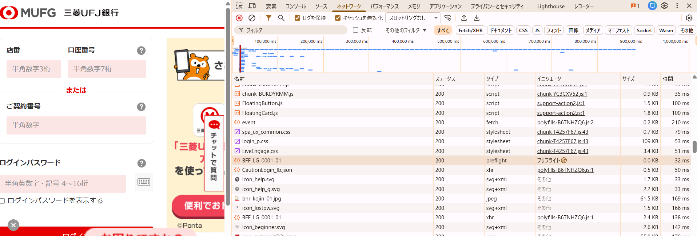
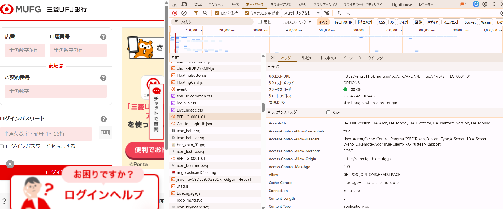
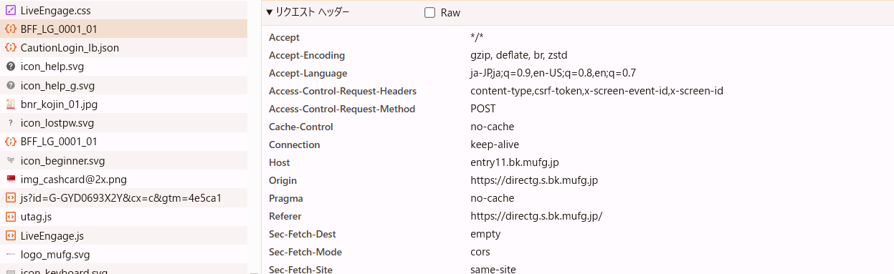

## 問題 15.11-15.17 🖋

実際のサービスの通信をデベロッパーツールなどで眺めて CORS の設定を確認しなさい。

(金融系の認証ページなどで CORS の設定がされていることが多い)

## 回答

三菱東京UFJダイレクトのログインページ（https://directg.s.bk.mufg.jp/）を DevTools の Network タブで観察した。

このページとは別オリジン（https://entry11.bk.mufg.jp/）の API へリクエストが送られていた。  

このリクエストヘッダーには Origin: https://directg.s.bk.mufg.jp が含まれており、レスポンスヘッダーには Access-Control-Allow-Origin: https://directg.s.bk.mufg.jp が返却されていた。

また、このPOSTリクエストの前にはプリフライトと書かれたリクエストもあるのを確認。  
OPTIONS メソッドの通信が発生しており、この Preflight のレスポンスには Access-Control-Allow-MethodsやAccess-Control-Allow-Headersが含まれており、許可されたメソッドとヘッダーを事前に確認してから本リクエストを送る挙動が確認できた。  

