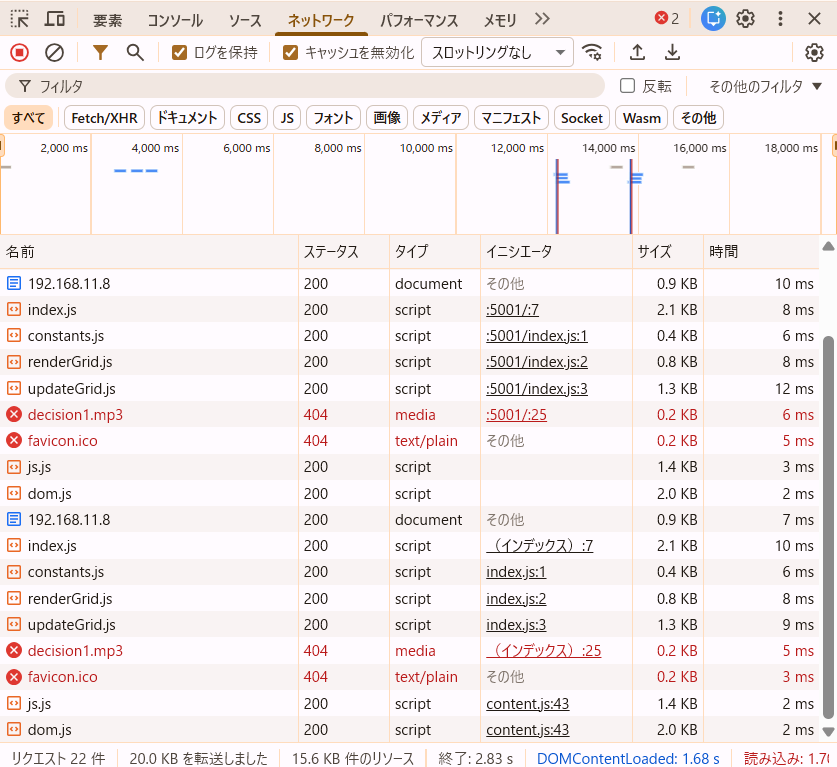
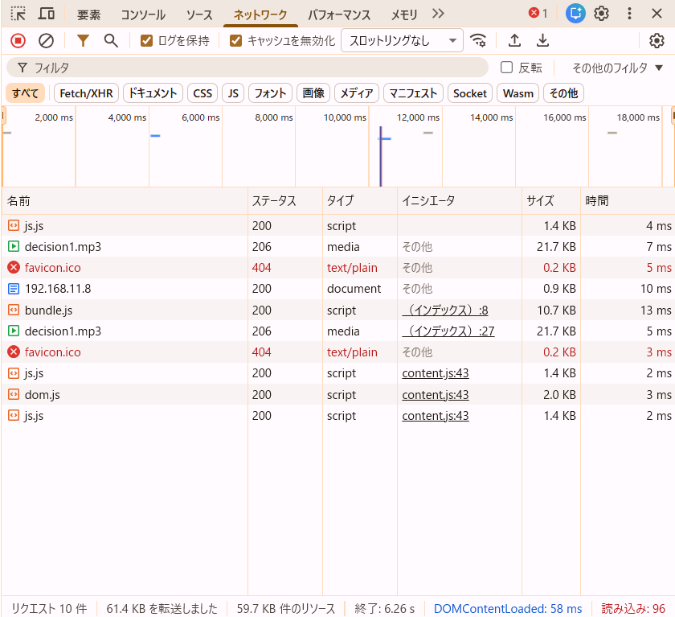

## 問題 17.5 💻🖋️

[問題 15.4-10.10](../ch15.04-10/README.md#問題-154-1010-) で作成したライフゲームのプログラムについて、プログラム中の関数(`updateGrid`, `renderGrid`)をそれぞれ別のファイルで export し、`index.js` から import して利用するよう修正しなさい。必要に応じて定数の export や関数の引数の変更を行ってもよい。
上記のコードを webpack を利用してバンドルし、バンドル前後のコードについて以下の点を調査して結果を記載しなさい。

- バンドルしたコードと元のコードを比較し、どのような処理が行われたかを確認しなさい。
- バンドル前後それぞれのコードを利用するページをローカルサーバで配信してブラウザから閲覧できるようにしなさい。  
  開発者ツールで `ネットワーク` タブを開き、スクリプトのダウンロード時間、ページの読み込み完了時間について比較しなさい。

## 回答

### バンドルしたコードと元のコードの比較

複数JSファイルが1つの bundle.js に統合された。  
import/export が消え、webpack独自の **webpack_require** と exports 定義に変換された。

### バンドル前後それぞれのページのローカルサーバで配信時のスクリプトのダウンロード時間、ページの読み込み完了時間比較

開発者ツールで `ネットワーク` タブでの、スクリプトのダウンロード時間、ページの読み込み完了時間比較。

- before
  

- after
  

バンドル前は index.js, constants.js, renderGrid.js, updateGrid.js の4ファイルを個別にダウンロードしていた。  
それぞれのスクリプトのダウンロード時間は合計約34msであった。

バンドル後は bundle.js 1ファイルのみの読み込みとなり、ダウンロード時間は約13msであった。

また、DOMContentLoaded は以下の通りであった。

- バンドル前：約1.68秒
- バンドル後：約58ms

バンドル後はリクエスト数が減少し、依存関係解決のオーバーヘッドが減ったことでページの初期表示が高速化したと考えられる。
