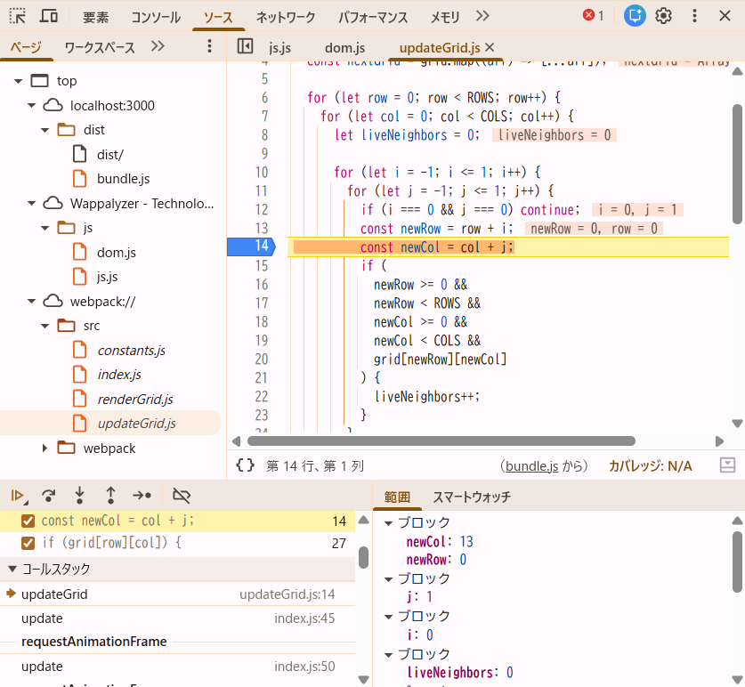

## 問題 17.6 🖋️

[問題 17.5](#問題-175-) について、webpack の設定でバンドル時にソースマップを生成するようにしなさい。
バンドルしたコードを利用するページをローカルサーバで配信してブラウザから閲覧し、開発者コンソールを利用して以下を確認して結果を記載しなさい。

- 開発者ツールで `ソース` タブ(Chrome, Edge, Safari) または `デバッガー` タブ(Firefox) を開き、ソースコードファイルがどのように表示されるかを確認しなさい。
- バンドルしたコードの実行中に、バンドル前のソースコードファイルに基づいたブレークポイントの設定や変数の値の確認等のデバッグが可能か確認しなさい。

## 回答
webpack.config.cjs に devtool: "source-map" を追加し、ビルドを行うと、bundle.js.map が生成された。  
ブラウザでbundle.jsを利用するindex.htmlのページを開き、開発者ツールの「ソース」タブを確認すると、webpack:// 以下に元のソースコード（index.js, renderGrid.js, updateGrid.js, constants.js）が表示されている。  

また、updateGrid.js 内にブレークポイントを設定したところ、実行時に元のソースコード上で停止し、変数の値を確認することができた。  
これにより、バンドル後であってもソースマップを利用することで、元のコードに基づいたデバッグが可能であることを確認した。   